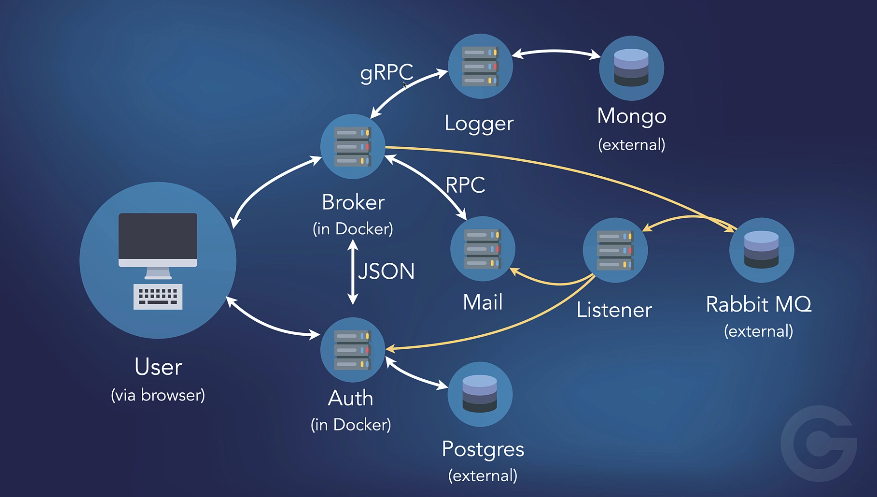

# [Go microservices course on Udemy](https://www.udemy.com/course/working-with-microservices-in-go)

## Some of the most common features for a microservice:
- It is maintainable and testable
- It is loosely coupled with other parts of the application
- It can be deployed by itself
- It is organized around business capabilities
- It is often owned by a small team

## The microservices I have built include the following functionality:
- A Front End service, that just displays a simple web page
- A Broker service, which is an optional single point of entry into the microservice cluster
- An Authentication service, with a Postgres database
- A Logging service, with a MongoDB database
- A Mail service, which takes a JSON payload, converts into a formatted email, and send it out
- A Listener service, which receives messages from RabbitMQ and acts upon them

## What I have learned
- Learn what Microservices are and when to use them
- How to develop loosely coupled, single purpose applications which work together as a distributed application
- How to communicate between services using JSON, Remote Procedure Calls, and gRPC
- How to push events to microservices using the Advanced Message Queuing Protocol (AMQP) using RabbitMQ
- How to deploy your your distributed application to a Kubernetes Cluster

## The picture of services

## Certificate (update after finishing this course)